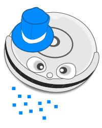

# Nom Nom the remote controlled Roomba

This was built for a break activity at CodeLand 2020 that allowed participants to remote control a Roomba using SMS and WhatsApp, powered by Twilio.

We will write a blog post about this and will link it here when done. Follow the repo for more updates.

## Project Structure

The project consists of multiple components. We are still updating the documentation and adding the last missing code but here's a rough structure:

- [`autopilot/`](autopilot): this handles all incoming messages and classifies them
- [`client/`](client): this contains both the UI that we embedded in the stream showing the messages and handles the incoming requests from Autopilot
- [`api/`](api): this API receives the parsed commands once displayed by the `client/` code and will batch them before sending them to the Roomba via Twilio Super SIM
- [`roomba/`](roomba): the code running on the microcontroller controlling the Roomba itself

## License

MIT
